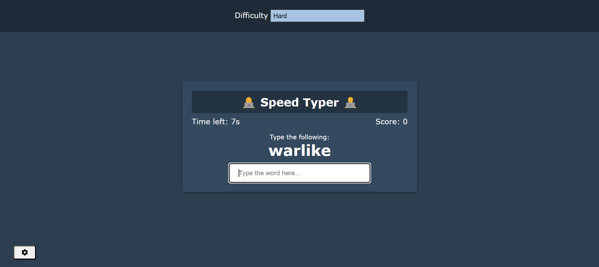

# RandomType
A simple web-based typing game to help improve speed and accuracy. Built without frameworks using pure HTML, CSS, and JavaScript for responsive and minimalist UI — perfect for learning and quick practice!   

### 🎯 Features
Random word generation   
   
Typing accuracy and speed tracking    
   
### 🚀 Getting Started
Clone the repo:
```
git clone https://github.com/richie48/random-type.git
cd random-type
```
Open localhost:5500 in your browser to play!


📚 Inspired By   
Based on vanillawebprojects.com's typing game for learning and refreshers.
